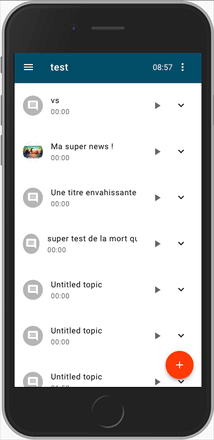

# GeekInc Remote Regie
Ce projet a pour but de proposer une interface afin de piloter la régie GeekInc en live depuis le canapé !

Pour le moment, il permet :
* de préparer les sujets et incrusts pour une émission via une [page de préparation](http://localhost:8081/emissions.html)
* de piloter les titres et incrusts à afficher via une [interface tactile simple](http://localhost:8081/presentateur.html)
* d'afficher les titres et incrusts dynamiquement via une [page overlay pour xsplit](http://localhost:8081/xsplit.html)

<p align="center">
  
</p>

## Installation
Prérequis :
- [Node v8](https://nodejs.org/en/download/current/)
- [MongoDB](https://docs.mongodb.com/manual/installation/)

```bash
git clone https://github.com/chriscamicas/girr
cd girr
# build the client
npm install --prefix client && npm build --prefix client
# install the server
npm install --only=production --prefix server
```

## Configuration
Copier le fichier `server/config/.env.defaults` vers `server/config/.env` et changer les valeurs.

## Lancement
```bash
npm start --prefix server
```

# Development

## Install all dependencies (including dev ones)
```bash
npm install --prefix client
npm install --prefix server
```

## Start the application
```bash
npm run dev --prefix server
npm run dev --prefix client
```

## TODO

- Tests unitaires
- Déploiement automatique
- Diagrammes
  - Architecture
  - Modèles
  - Routes
- voir reprendre les composants mis en place sur https://github.com/codlab/TwitchToast

## Licence
This project is licensed under the MIT license.
